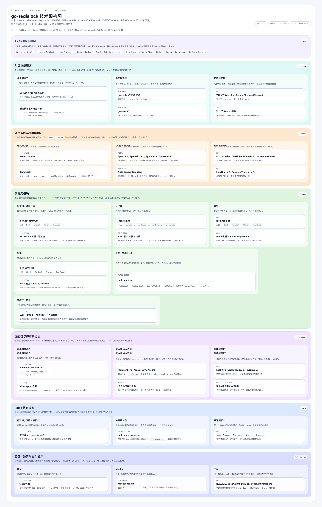

# Blueprinter

以扁平化工程蓝图风格，使用纯 HTML/CSS 生成分层彩色技术架构图。

## 概述

Blueprinter 是一款面向软件工程场景的可视化技能，它通过语义分层、色带分区与工程化排版，将复杂的系统架构转化为清晰可扫读的技术图表。输出为单一自包含 HTML 文件，无需任何依赖或构建工具，浏览器直接打开即可查看。

核心理念：**精确、分层、分区、可扫读**。生成结果应像一张经过工程化约束的信息图——有明确的层级归属、区域划分、模块分组与阅读路径，而非白底规格书或营销落地页。

## 效果预览

### 示例




## 适用场景

- **系统架构图**：微服务拓扑、服务网格、分层系统地图
- **流程图**：业务流程、数据流转、请求链路
- **技术说明图**：任何需要"语义分层 + 色带分区 + 工程化排版"的技术可视化

## 触发方式

在 Claude Code 中提及以下关键词即可触发该技能：

- 蓝图风格 / 蓝图风
- 扁平技术图
- 架构可视化
- 技术图纸
- Blueprint style

示例对话：

```
/blueprinter 帮我画一张当前项目的服务架构图

/blueprinter 用扁平技术图展示我们的系统分层

/blueprinter Generate a blueprint-style architecture diagram for our payment system
```


