# Mermaid 语法参考

高级图表类型的详细语法规则。需要具体语法细节时请加载本文件。

---

## 时序图语法

### 消息
```
->>   实线箭头
-->>  虚线箭头
-)    实线空心箭头
--)   虚线空心箭头
```

### 激活与注释
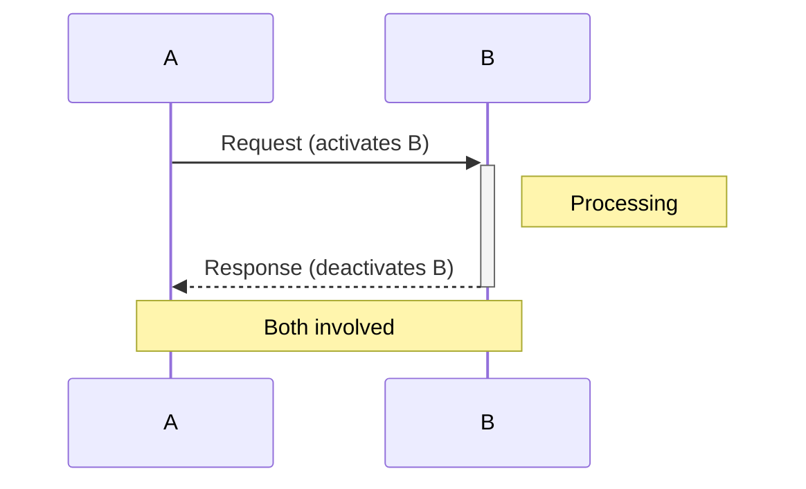

### 循环与条件
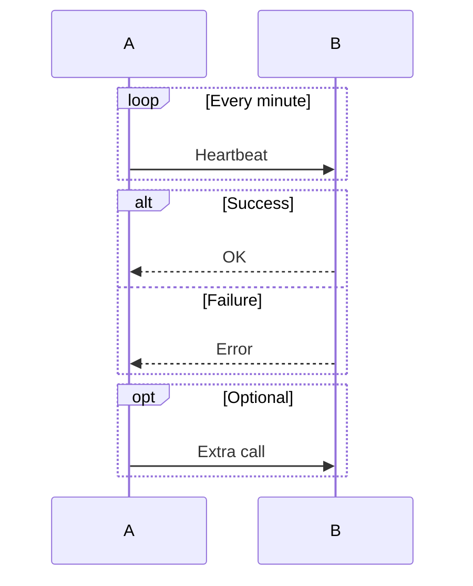

---

## 类图语法

### 关系
```
<|--  继承
*--   组合
o--   聚合
-->   关联
--    连接（实线）
..>   依赖
..|>  实现
```

### 类定义
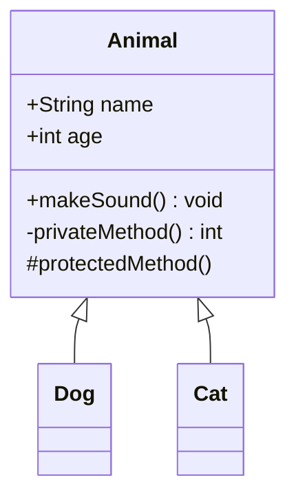

---

## ER 图语法

### 基数
```
||--||  一对一
||--o{  一对多
}o--o{  多对多
||--o|  一对零或一
```

### 示例
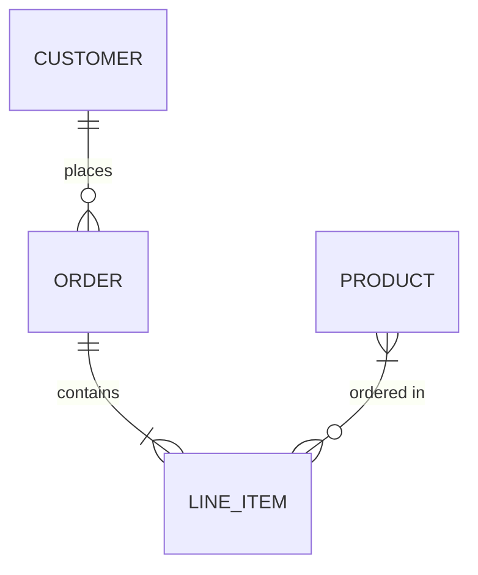

---

## 甘特图语法

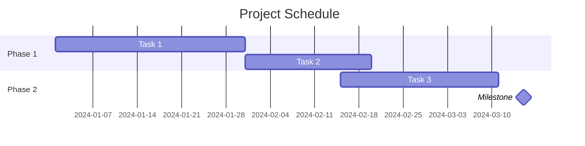

### 任务状态
```
done     已完成任务
active   当前任务
crit     关键路径
```

---

## 用户旅程图语法

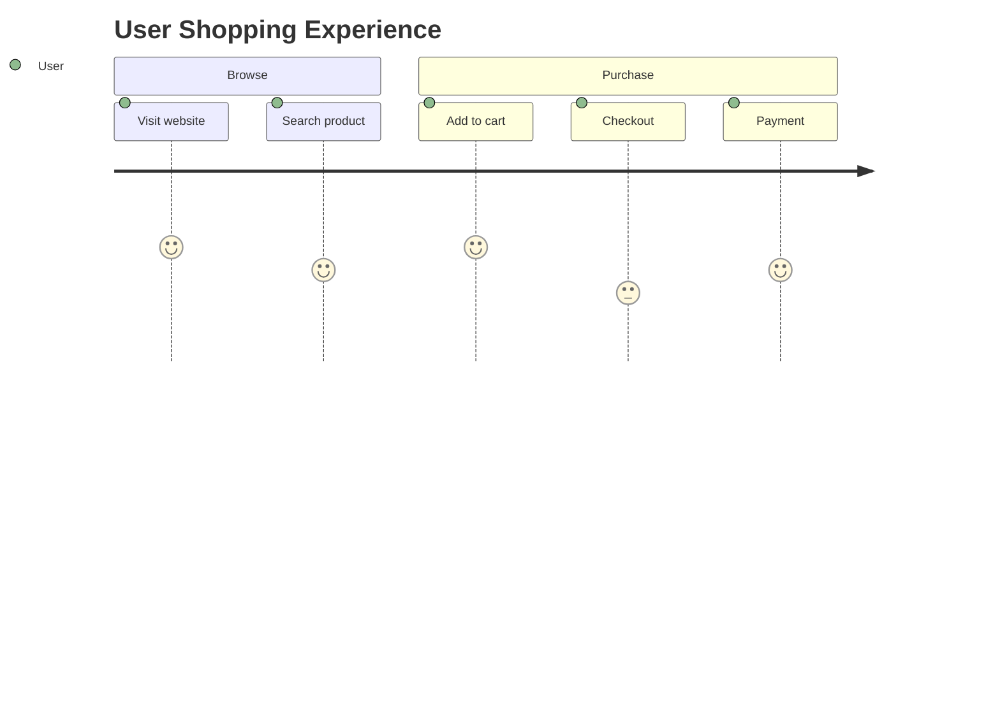

评分范围：1（差）到 5（优秀）

---

## XY 图语法

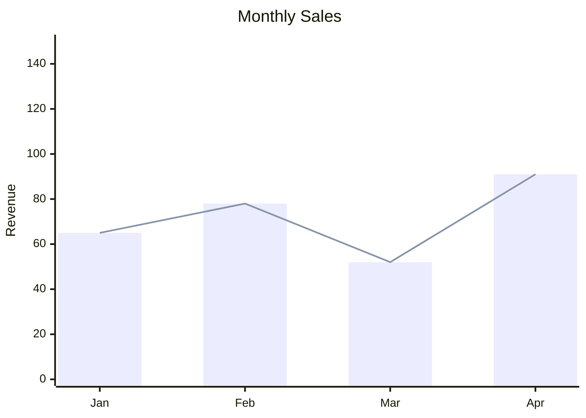

---

## 看板语法

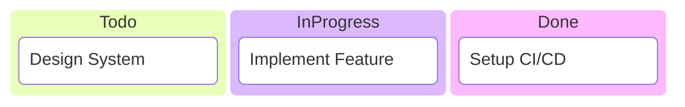

---

## 布局与样式

### 方向
- `TB` / `TD` — 从上到下（默认）
- `LR` — 从左到右
- `RL` — 从右到左
- `BT` — 从下到上

### 节点样式
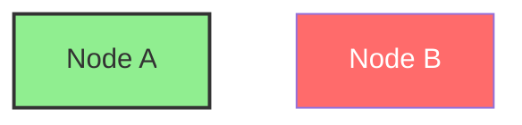

### 类定义样式
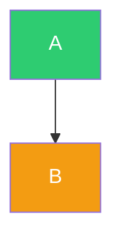

### 连线样式
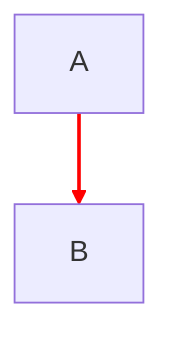

---

## 子图进阶

### 嵌套子图
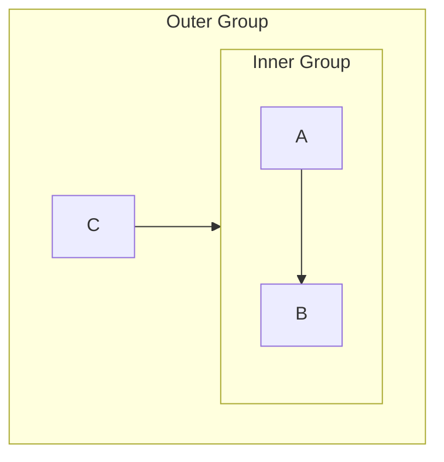

### 子图方向
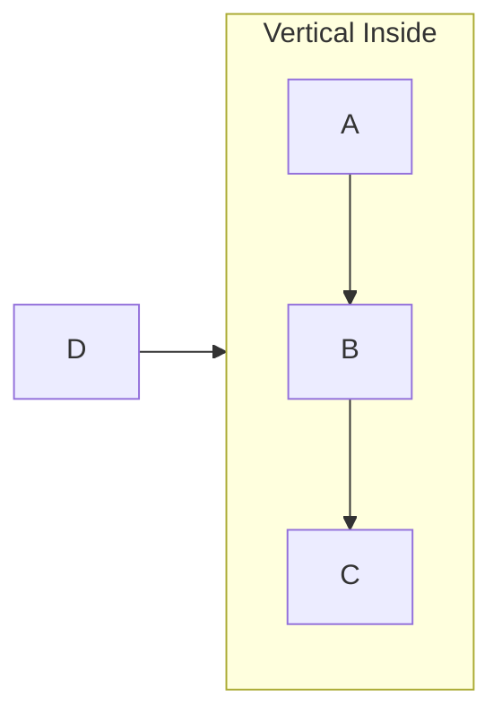
